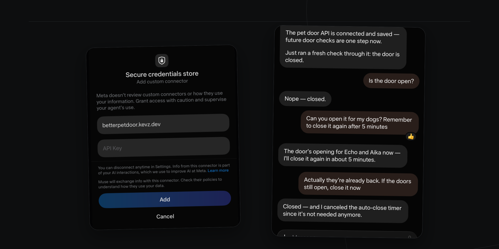

# Better Pet Door

An open-source, self-hosted web app and REST API for controlling any compatible pet door.

Wayzn is the first supported provider. The provider boundary is intentionally small so other doors can be added without changing the dashboard or API.

> Better Pet Door is unofficial and is not affiliated with or endorsed by Wayzn. Only connect devices and accounts you own or are authorized to control.

## Featured example

Here Muse connects to the self-hosted API, checks a door, opens it for five minutes, then closes it early.



## What works

- Password-protected web dashboard
- Any number of pet doors in one instance
- Webcam scanning for Wayzn “Add New User” QR codes
- Open, close, open-and-close, and live status
- Opt-in local dog detection with per-door camera mode, durable timed close, and manual overrides
- Remote MCP server with OAuth for ChatGPT, Codex, Claude, and other agents
- REST API authenticated with the admin password
- OpenAPI 3.1 document for agents without MCP support
- SQLite persistence
- AES-GCM encryption for provider credentials at rest
- Docker and Fly.io deployment

The Wayzn password is used once to obtain a refresh token. It is never stored. QR device keys and refresh tokens are encrypted before being saved to SQLite.

## Connect an agent

Use your instance's MCP endpoint:

```text
https://your-host.example/mcp
```

OAuth opens a Better Pet Door page and asks for the admin password. There is one `mcp` permission covering both status and control.

See [Connect ChatGPT, Codex, Claude, and Muse](docs/agents.md) for setup instructions.

## Get the Wayzn Firebase API key

Better Pet Door does not include Wayzn's Firebase API key. Extract it from your own copy of the Wayzn Android app and pass it to the server as an environment variable.

Download a current Wayzn XAPK from a source you trust. An XAPK is a ZIP file containing a base APK and architecture-specific split APKs. For an ARM64 package:

```sh
mkdir -p /tmp/wayzn-xapk /tmp/wayzn-arm64
unzip Wayzn.xapk -d /tmp/wayzn-xapk
unzip /tmp/wayzn-xapk/config.arm64_v8a.apk -d /tmp/wayzn-arm64
strings /tmp/wayzn-arm64/lib/arm64-v8a/libapp.so \
  | grep -Eo 'AIza[0-9A-Za-z_-]{35}' \
  | sort -u
```

Use the matching split and `lib` path if you downloaded another architecture, such as `armeabi_v7a`. The command should print exactly one value. Keep it out of source control even though Firebase API keys are client identifiers rather than passwords.

## Run with Docker

Clone the repo, create two different random secrets, and set the key you extracted above:

```sh
git clone https://github.com/k15z/betterpetdoor.git
cd betterpetdoor
export BETTERPETDOOR_ADMIN_PASSWORD="$(openssl rand -base64 32)"
export BETTERPETDOOR_SECRET_KEY="$(openssl rand -base64 32)"
export BETTERPETDOOR_WAYZN_FIREBASE_API_KEY="paste-the-extracted-value-here"
docker compose up --build
```

Open [http://localhost:8080](http://localhost:8080) and sign in with `BETTERPETDOOR_ADMIN_PASSWORD`.

Keep `BETTERPETDOOR_SECRET_KEY` stable. Changing it makes saved door credentials unreadable. Changing the admin password on restart invalidates existing browser sessions.

## Phone camera mode

Use a camera page for local dog detection and explicitly arm the selected door. Automatic close defaults to five minutes and is configurable; physical provider safety checks must explicitly pass. Manual Open/Close overrides stop camera automation.

**Timed closing is triggered by the mounted phone.** Keep the camera page open and the phone awake and connected. Its close request wakes an auto-stopped server. Stopping detection retains the timer while the page stays open; cancelling the close is a separate action. See [camera mode, safety, and recovery](docs/camera-mode.md) before using a real door.

## REST API

Use the admin password as a bearer token:

```sh
curl -H "Authorization: Bearer $BETTERPETDOOR_ADMIN_PASSWORD" \
  http://localhost:8080/api/doors
```

Routes:

| Method | Path | Purpose |
| --- | --- | --- |
| `GET` | `/healthz` | Health check; no authentication |
| `GET` | `/api/doors` | List doors |
| `POST` | `/api/doors` | Pair and save a door |
| `DELETE` | `/api/doors/{id}` | Remove a door |
| `GET` | `/api/doors/{id}/status` | Read normalized status |
| `POST` | `/api/doors/{id}/commands/open` | Open |
| `POST` | `/api/doors/{id}/commands/close` | Close |
| `POST` | `/api/doors/{id}/commands/open-and-close` | Open, then close |

Pairing request:

```json
{
  "name": "Kitchen",
  "provider": "wayzn",
  "qr_payload": "contents of the Add New User QR code",
  "email": "your Wayzn email",
  "password": "your Wayzn password"
}
```

Do not put the bearer token or pairing payload in a URL.

The machine-readable OpenAPI 3.1 document is available without authentication at `/openapi.json`.

## Fly.io

The included configuration uses one `shared-cpu-1x` machine with 256 MB RAM, auto-stop, and a persistent volume at `/data`.

```sh
fly launch --copy-config --no-deploy
fly volumes create betterpetdoor_data --size 1 --region sjc
fly secrets set \
  BETTERPETDOOR_ADMIN_PASSWORD="$(openssl rand -base64 32)" \
  BETTERPETDOOR_SECRET_KEY="$(openssl rand -base64 32)" \
  BETTERPETDOOR_WAYZN_FIREBASE_API_KEY="paste-the-extracted-value-here"
fly deploy
```

Choose a unique app name during `fly launch`. Use the same region for the app and volume.

At [Fly.io's published September 2026 rates](https://fly.io/docs/about/pricing/), this shape is normally below $5/month for a personal instance: roughly $2.32/month if the San Jose machine runs continuously, plus $0.15/GB-month for the volume and $0.08/GB-month for default snapshots. Auto-stop reduces compute cost. Network use, certificates, pricing changes, and optional services can change the total.

SQLite supports one active Better Pet Door machine. Do not scale this deployment horizontally.

### Automatic Fly deployments

After the first Fly setup, add an app-scoped deploy token and app name to the GitHub repository:

```sh
fly tokens create deploy --app your-app-name --expiry 8760h \
  | gh secret set FLY_API_TOKEN
gh variable set FLY_APP_NAME --body your-app-name
```

Every push to `main` then runs the full test suite and deploys only after it passes. Fly secrets and the persistent volume remain managed outside GitHub Actions.

## Develop locally

```sh
cp .env.example .env
cd web && npm install
```

Export the `.env` values. Run the API and Vite in separate terminals:

```sh
go run ./cmd/betterpetdoor
```

```sh
cd web && npm run dev
```

The Vite server proxies `/api` to port 8080. Build everything with `make build`; test with `make test`.

## Configuration

| Variable | Default | Notes |
| --- | --- | --- |
| `BETTERPETDOOR_ADMIN_PASSWORD` | required | At least 12 characters; browser login and REST bearer token |
| `BETTERPETDOOR_SECRET_KEY` | required | At least 32 characters; encrypts saved provider credentials |
| `BETTERPETDOOR_WAYZN_FIREBASE_API_KEY` | required | Extracted from the Wayzn Android app; used for Firebase authentication |
| `BETTERPETDOOR_DB_PATH` | `./data/betterpetdoor.db` | SQLite file |
| `BETTERPETDOOR_WEB_DIR` | `./web/dist` | Built SPA directory |
| `BETTERPETDOOR_ADDR` | `:8080` | HTTP listen address |
| `BETTERPETDOOR_SECURE_COOKIE` | `false` | Set to `true` behind HTTPS |

## License

[MIT](LICENSE)
